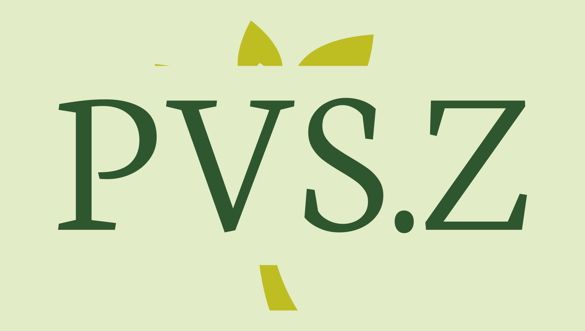

# COMP30022 Team Project

## About our team

This is Team **Now You See Me** from Tutorial Mon 17:15-19:15.

Our team members are **Jiayi Wu** & **Wuge Liu** & **Xuanhao Zhang** & **Yikun Tu** & **Zhenchen Wan**.

### Role Assignment.
| Name | Role |
| ---------- |:------------------------------------------------------------------------------------------:|
| `Jiayi Wu` | UI Design & Frotend Developer & Frontend Lead |
| `Wuge Liu` | Frontend Developer & Product Owner |
| `Xuanhao Zhang` | Backend Developer & Frontend Developer & Backend Leader |
| `Yikun Tu` | Backend Developer & Quality Assurance / Testing Lead |
| `Zhenchen Wan` | Backend Developer & Frontend Developer & Scrum Master |

### Workflow Control

In this project, we choose to use [Monday](https://student543001.monday.com/boards/3128765258) and GitHub to manage our workflow. 

Below are our overall workflow diagram and git workflow diagram respectively. 
<p align="center">
    
</p>

<p align="center">
    overall workflow
</p>

<p align="center">
    
</p>

<p align="center">
    git workflow
</p>


## About our project
This web application named ‘PvsZ’ (only for phone size) used for tracking the plants' condition and help our users take better care of their plants. The tools we used are React, MongoDB and Node.js. In this app, the user can add plants, remove plants, search plants, record the details of their plants, group their plants and get the alert message if the plant needs to be watered, sunshined or other actions should be taken. this project will span about 12 weeks and will be done so in Agile Methodology, we choose to divide the work in 3 sprints. Furthermore, except the general functions, this app also follows the client requirements. 
See the full list of requirements at our [Confluence](https://jwwu5.atlassian.net/wiki/spaces/IP/overview?homepageId=196693). 

### This is our logo: 
<p align="center">
    
</p>

<p align="center" style="font-style: italic">
    logo of this product
</p>

## Building Technologies

## Install

This project uses [node](http://nodejs.org) and [npm](https://npmjs.com). Go check them out if you don't have them locally installed.

Backend

```sh
$ cd pvsz-api
$ npm install

```

Frontend

```sh
$ cd pvsz-web
$ npm install
```

## Run

Backend

```sh
$ cd pvsz-api
$ npm run dev
```

Frontend

```sh
$ cd pvsz-web
$ npm run start
```

### Contributors
- Zhenchen Wan [@ZhenchenWan](https://github.com/ZhenchenWan)
- Wuge Liu [@jzh398](https://github.com/jzh398)
- Jiayi Wu [@JWWU5](https://github.com/JWWU5)
- Xuanhao Zhang [@XUANHZHANG](https://github.com/XUANHZHANG)
- Yikun Tu [@Tykkk1026](https://github.com/Tykkk1026)